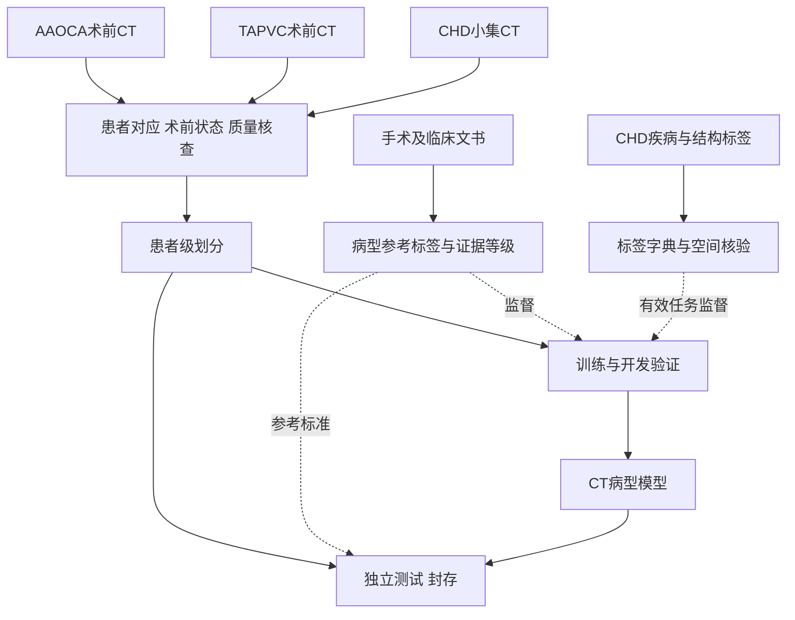
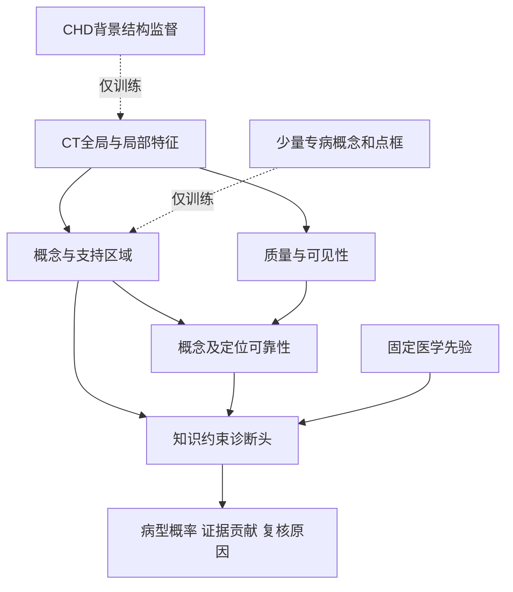

# 纯CT先心病型诊断结构图

当前目标：病型诊断。手术与临床文书用于参考标签，使用时只有CT。

## 数据与监督关系

```mermaid
flowchart TD
  A[AAOCA术前CT] --> D[患者对应 术前状态 质量核查]
  B[TAPVC术前CT] --> D
  C[CHD小集CT] --> D
  W[手术及临床文书] --> L[病型参考标签与证据等级]
  H[CHD疾病与结构标签] --> M[标签字典与空间核验]
  D --> P[患者级划分]
  P --> T[训练与开发验证]
  P --> Z[独立测试 封存]
  L -.监督.-> T
  L -.参考标准.-> Z
  M -.有效任务监督.-> T
  T --> N[CT病型模型]
  N --> Z
```

## Baseline

```mermaid
flowchart LR
  A[CT] --> B[全局与局部区域]
  B --> C[预训练3D ResNet18]
  C --> D[轻量区域聚合]
  D --> E[多标签病型]
  E --> F[校准与患者级验证]
```

## 概念与可靠性版本

```mermaid
flowchart TD
  A[CT全局与局部特征] --> B[概念与支持区域]
  A --> Q[质量与可见性]
  B --> R[概念及定位可靠性]
  Q --> R
  B --> D[知识约束诊断头]
  R --> D
  K[固定医学先验] --> D
  D --> O[病型概率 证据贡献 复核原因]
  C[CHD背景结构监督] -.仅训练.-> A
  S[少量专病概念和点框] -.仅训练.-> B
```

图中流程为拟议设计，尚未运行。完整规则见[总方案](../reports/13_AAOCA_TAPVC_CHD联合研究总方案.md)。
