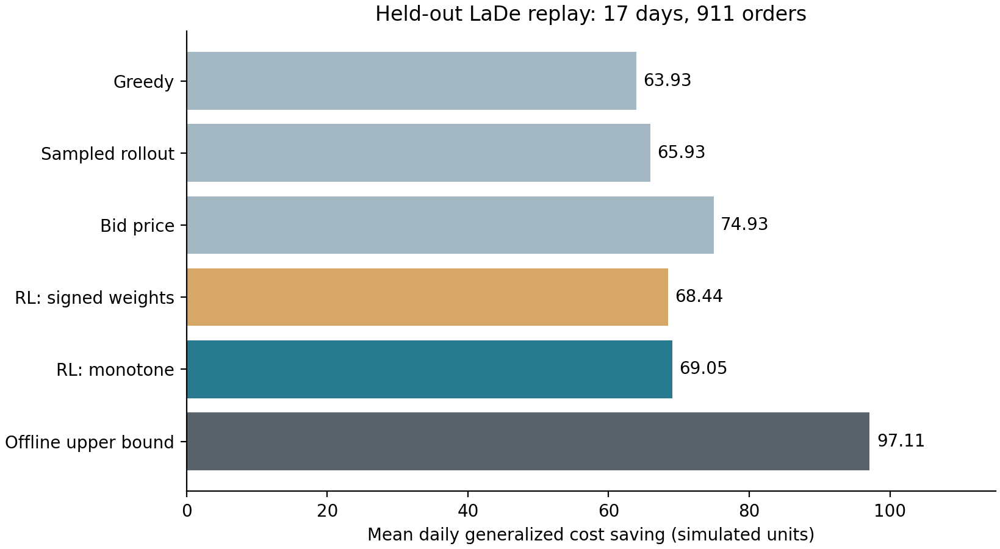

# 共享起降与充电资源下的无人机预约派送

这是面向 TRC 选题要求完成的一次可复现研究试验，含场景、数学模型、强化学习求解、公开数据和真实运行结果。当前是研究初稿，**未达到已确认创新或可直接投稿的状态**。

- [英文论文源文件](manuscript.tex)：完整模型、结构命题、算法、实验与局限。
- [创新审查与下一步](NOVELTY.md)、[独立审查处理记录](REVIEW.md)。
- [逐日实验记录](results/experiment.json)、[统计汇总](results/summary.json)、[结果图](figures/test_results.png)。
- [公开数据清单](data/manifest.json)：来源、哈希、切分与假设。
- [第二轮开发结果](development/RESULTS_02.md)：联合情景预约、资源组合TD与条件LP前瞻；五种子验证83.54对84.13，仍未达到目标。[公开飞行测量数据](development/PUBLIC_FLIGHT_DATA.md)已取得，尚未用于校准。

## 已运行结果

数据来自官方 [LaDe](https://huggingface.co/datasets/Cainiao-AI/LaDe)，论文为 [Wu et al.](https://arxiv.org/abs/2306.10675)。下载吉林文件31,415条记录。按原始日期分割后选训练中最多的区域，保留07–11点任务，得到训练4,667、验证2,559、测试911条。测试17个非空日，其中5天各1单。以真实目的地和接单时刻构造合成五分钟时段揭示；速度、起降、充电、费用、期限均为模拟。

| 策略 | 日均节省（模拟广义成本单位） |
|---|---:|
| 贪心 | 63.93 |
| 训练日抽样前瞻 | 65.93 |
| 容量定价 | **74.93** |
| 无符号约束权重RL | 68.44 |
| 容量单调RL | 69.05 |
| 先知MILP | 97.11 |

RL使用5个训练种子，每个400个抽样训练日。单调RL对贪心均值+8.01%，对容量定价−7.85%；对无符号约束参数化仅+0.89%，日配对区间含零。不能据此证明单调结构优势。先知MILP知道全天订单，是比较界，信息条件不同。两架无人机的冻结策略测试中RL也落后贪心。



## 复现

在仓库中的 `or-research-agent` 目录执行。Python环境需要 NumPy、SciPy、PyTorch、Matplotlib，具体运行版本见结果JSON。先安装根目录的 `requirements.txt`，不需要模型API密钥或GPU。

```sh
python -X utf8 studies/trc_capacity_rl/src/prepare_data.py --download
python -X utf8 -m unittest discover -s studies/trc_capacity_rl/tests -v
python -X utf8 studies/trc_capacity_rl/src/run_experiment.py --epochs 400
python -X utf8 studies/trc_capacity_rl/src/summarize.py
```

如环境要求本地代理，下载命令增加 `--proxy http://127.0.0.1:7897`。下载文件哈希不一致时脚本拒绝继续。原始数据不随本仓库分发；官方卡片标注Apache-2.0，使用者应查看其当前说明。

结果生成在固定 `results` 目录，重复实验前先保存已有结果。模型身份不匹配时拒绝复用；确认要重新训练可加 `--retrain`。已发布的权重支持复现同一模型，但版本/代码不一致时应重新训练并保留旧记录。默认任务的奖励和动作在本机复跑一致，耗时随环境变化。

## 解释边界

该环境没有真实无人机轨迹、天气、载重、空域冲突或电池SOC。固定充电时间与范围筛选不能替代飞行安全模型。地面后备无限，因此不能用该试验主张总体履约率提升。时间按五分钟向下量化并同槽按哈希排序，是合成揭示过程，不宣称原始时刻在线可执行。模型创新与论文质量仍需研究者审查。
