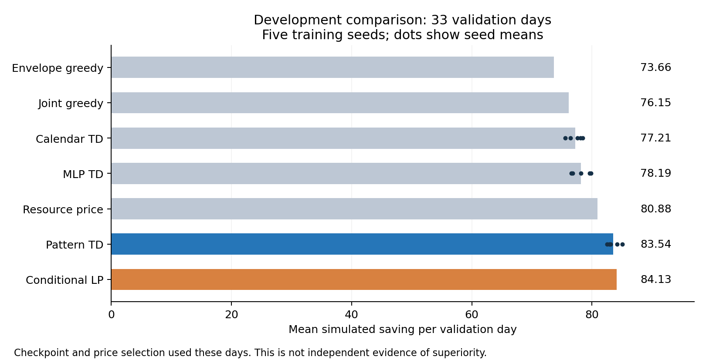

# 第二轮开发结果：尚未达到研究目标

2026-10-04。33个既有验证日；每架构5种子、每种子200个抽样训练日。所有权重选择和基线调参均使用验证集，**这不是独立确认结果**。

| 同一联合情景可行域下的策略 | 模拟节省/日 |
|---|---:|
| 即时贪心 | 76.15 |
| 分离容量特征TD | 77.21 |
| 普通MLP TD | 78.19 |
| 验证选价策略 | 80.88 |
| 资源组合特征TD | 83.54 |
| 条件训练日LP前瞻 | **84.13** |

新方法较价格+3.28%，较当前最好前瞻−0.70%。模式网络五种子均值82.47、84.16、85.06、83.09、82.90；不得挑选最好种子替代均值。三个架构共享8维可观测上下文，但参数量和特征尺度不同，不能把差异完全归因于单一结构。不同预算之间也不构成控制变量结论。

另一个**建模**对照：包络贪心73.66、联合情景贪心76.15，区别来自预约可行域，不能当作RL优势。两订单穷举分别7.6786和15.3571，只说明联合情景和逐单包络的严格差别，不是实测收益。



## 完整记录和检查

- [当前五种子实验](results/pilot_002/experiment.json)、[前瞻调参](results/lookahead_002/experiment.json)、[汇总](results/summary_02.json)。693个策略/日记录的有限情景审计全部通过；不是693个独立需求日。
- 研究检查18项通过。新增9项包括逐情景可行性、独立重算防伪、包络严格例、未来后缀不变性、同槽两单反例、模式单调性。
- 条件LP权重0.25/0.5/1.0全保留，均无求解失败。选中权重0.5发生4次超出训练槽内计数支持的回退；这不同于求解失败，不能漏报。
- 早期 `pilot_001` 和 `lookahead_001` 的限制/失败完整保留。早期权重使用旧特征接口，不与当前接口兼容；当前可复现权重位于 `pilot_002`。
- 原始首版试验、17天旧测试和69.05对74.93的负面结果未覆盖。新保留确认数据尚未打开。
- 当前源码使用实际整数时间/容量参数。已知小问题：整数值浮点参数如16.0会通过前置语义检查但在数组构造失败；默认配置不受影响，尚未做输入类型规范化。
- 现有论文原位增加开发附录；宿主编译器仍报 `Unable to find standard directories for platform`，未确认PDF编译与排版。

## 复现

先按研究README准备LaDe数据。命令中改用新的运行名，脚本拒绝覆盖旧目录。

```sh
python -X utf8 studies/trc_capacity_rl/src/run_scenario_development.py --name new_development --epochs 200 --seeds 11 22 33 44 55
python -X utf8 studies/trc_capacity_rl/src/evaluate_scenario_lookahead.py --name new_lookahead --samples 3 --weights 0.25 0.5 1.0
```

## 下一项可证伪工作

首先校准或收窄共同扰动假设，测试独立残差是否消除包络差别；其次检查增加训练预算是否仍改善模式方法，而非只追逐验证集。只有开发方案和强基线稳定后，冻结新确认协议。文献首次性、集合外可靠性和新测试泛化均未获证实，继续列为未完成。
