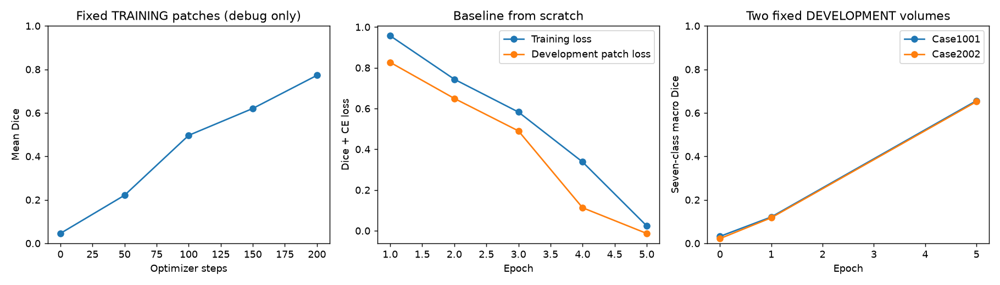
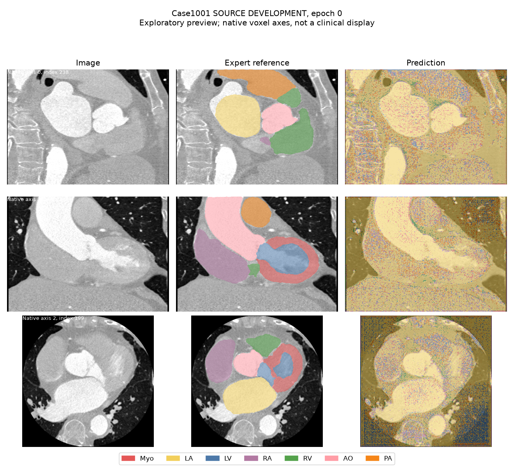
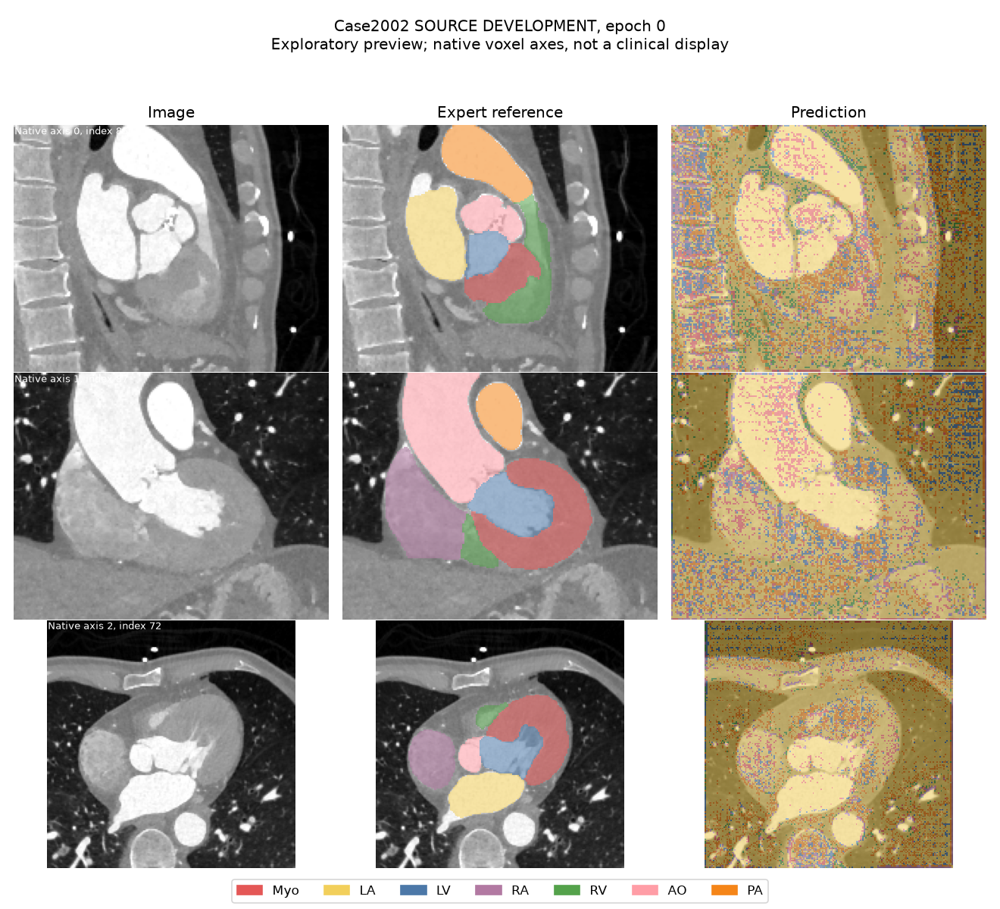
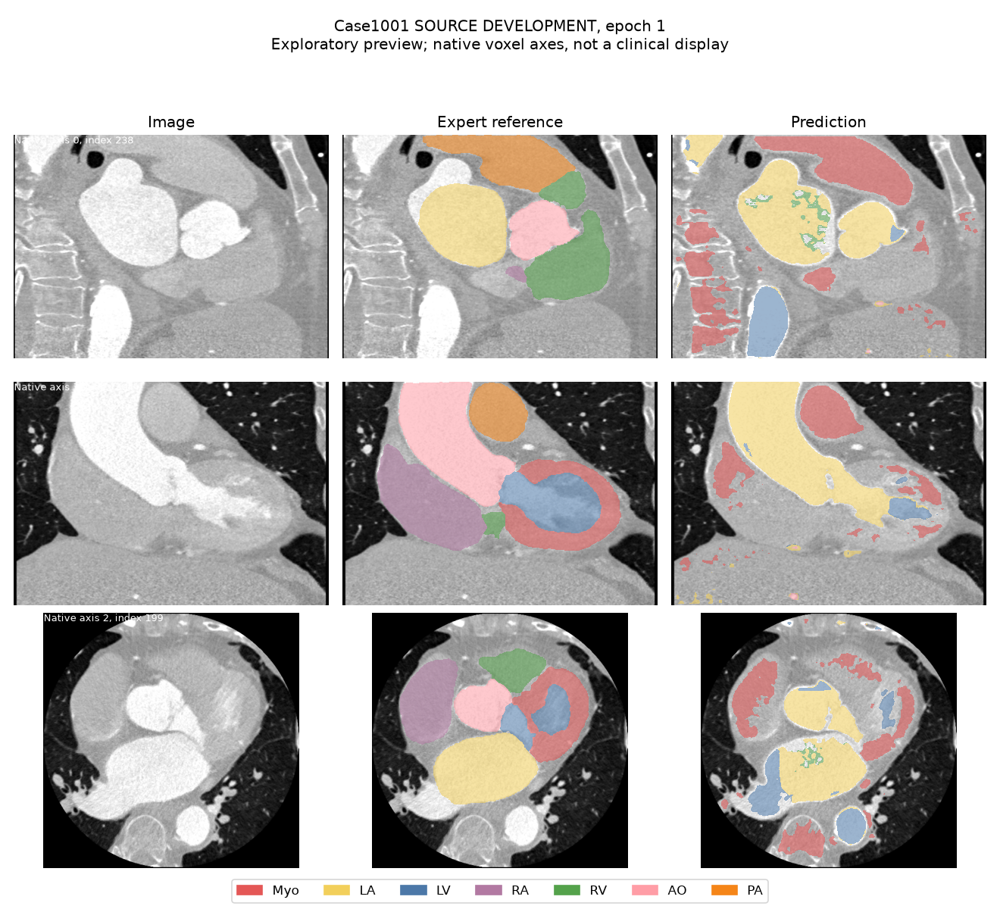
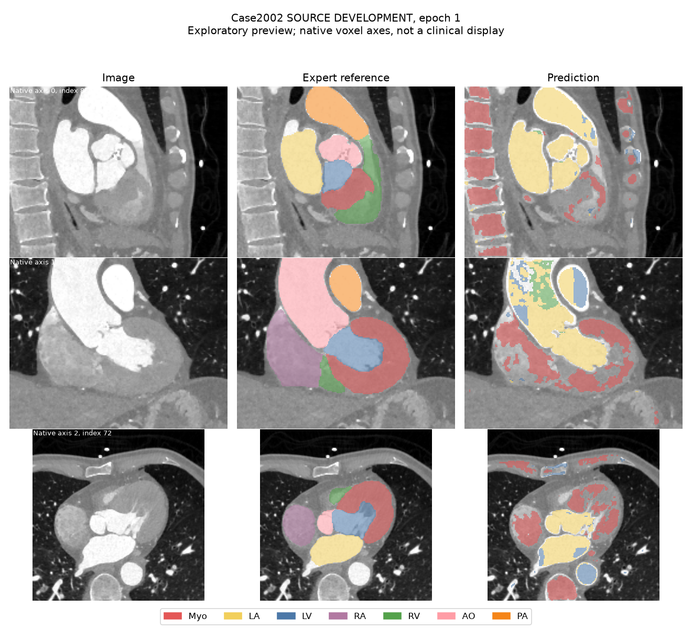
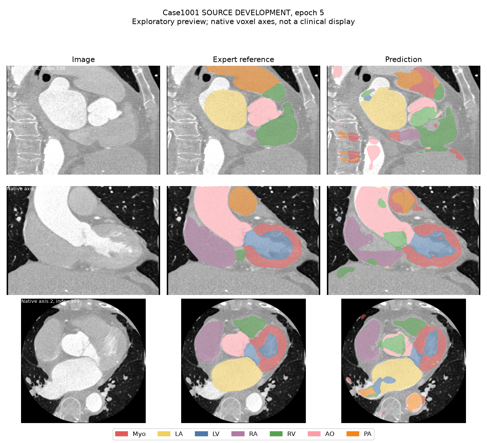
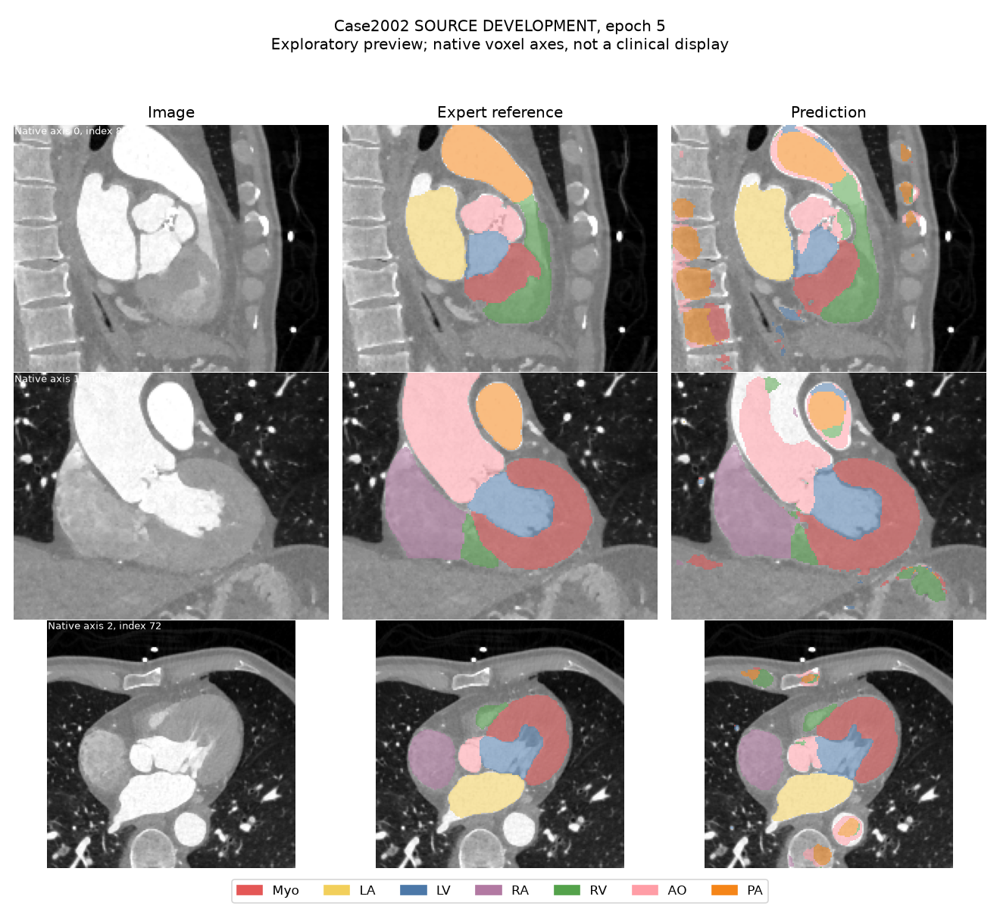

# CT 小型预实验记录

## Material Passport

Origin: academic_tools experiment-agent / local_preexperiment.py；Status: 单次实际运行记录，尚无独立重复验证。

运行：preexperiment_ct_B0_seed0_20260920_190341；状态：**completed**；耗时：22.8 分钟。

GPU：NVIDIA GeForce RTX 5060 Ti。仅 CT、B0、ct_holdG；外层 G 中心未推理、未评分。

来源训练共 30 例，来源开发共 8 例。固定看图病例：Case1001, Case2002，选择规则是每个来源中心排序后的首例，不按成绩选择。

## 小样本排错

在 Case1002, Case2001 各取一个固定小批次，反复学习其中的三维块；关闭随机增强及权重衰减。这是训练块拟合检查，不是完整病例拟合，也不是泛化评价。实际完成 200 步。

| 步骤 | 同一训练块损失 | 同一训练块平均Dice |
|---:|---:|---:|
| 0 | 2.7267 | 0.0456 |
| 50 | 0.3995 | 0.2210 |
| 100 | -0.0063 | 0.4966 |
| 150 | -0.2961 | 0.6202 |
| 200 | -0.5517 | 0.7725 |

## 初步基线

重新从随机初始化训练，没有加载拟合排错权重。实际完成 5 轮 / 1250 个优化步骤；学习率保留原来250轮调度，只截取前几轮。

| 完成轮数 | 训练损失 | 开发小块损失 | 开发小块近似Dice |
|---:|---:|---:|---:|
| 1 | 0.9572 | 0.8267 | 0.1427 |
| 2 | 0.7438 | 0.6495 | 0.1909 |
| 3 | 0.5827 | 0.4901 | 0.2846 |
| 4 | 0.3377 | 0.1129 | 0.6102 |
| 5 | 0.0239 | -0.0132 | 0.7069 |

## 固定来源开发病例的完整体积分割

以下为完整网格、逐类Dice的简单平均，不是体积加权官方WHS指标。没有血管截断或后处理；本次不计算HD。近似Dice与完整病例Dice不能混用。

| 轮数 | 病例 | 七类平均Dice | Myo | LA | LV | RA | RV | AO | PA |
|---:|---|---:|---:|---:|---:|---:|---:|---:|---:|
| 0 | Case1001 | 0.0319 | 0.0654 | 0.0544 | 0.0043 | 0.0478 | 0.0073 | 0.0002 | 0.0437 |
| 0 | Case2002 | 0.0217 | 0.0767 | 0.0355 | 0.0039 | 0.0321 | 0.0021 | 0.0010 | 0.0005 |
| 1 | Case1001 | 0.1212 | 0.1633 | 0.5120 | 0.1728 | 0.0000 | 0.0000 | 0.0000 | 0.0000 |
| 1 | Case2002 | 0.1176 | 0.2789 | 0.4557 | 0.0884 | 0.0000 | 0.0000 | 0.0000 | 0.0000 |
| 5 | Case1001 | 0.6560 | 0.6850 | 0.8703 | 0.7672 | 0.6353 | 0.5738 | 0.5579 | 0.5021 |
| 5 | Case2002 | 0.6515 | 0.8276 | 0.8431 | 0.8352 | 0.7791 | 0.4572 | 0.4429 | 0.3757 |

### Case1001：第 0 轮

### Case2002：第 0 轮

### Case1001：第 1 轮

### Case2002：第 1 轮

### Case1001：第 5 轮

### Case2002：第 5 轮

## 解释边界

- 只检查CT及两个预先选定的来源开发病例；没有评价全部开发集完整体积，没有MRI结果，没有外层跨中心结果。
- 未比较B1、未做多随机种子，不能据此判断增强收益或最终模型性能。
- 图像切片按参考标注中心固定选择，图像用于定位错误；三张切片不能代表整个体积，数值使用完整体积。
- 预实验与正式实验独立保存，不能把本次已观察的开发成绩当作独立测试结果。
- run.json 记录代码/计划/划分哈希、设备、时间、完整参数和异常；pip_freeze.txt 记录实际环境。

绘图备注：完成训练后修复了 nnU-Net 全局字体设置导致的图例遮挡，仅重新绘图，没有更新模型、预测或指标。原始训练代码保存在实验目录的 `code_snapshot/`；重绘记录见该目录的 `figure_render_record.json`。
